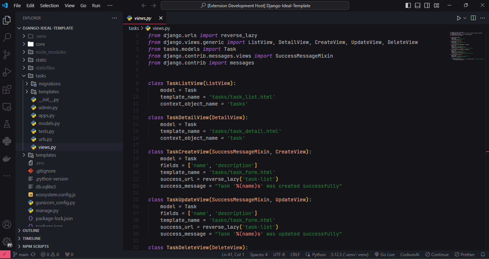
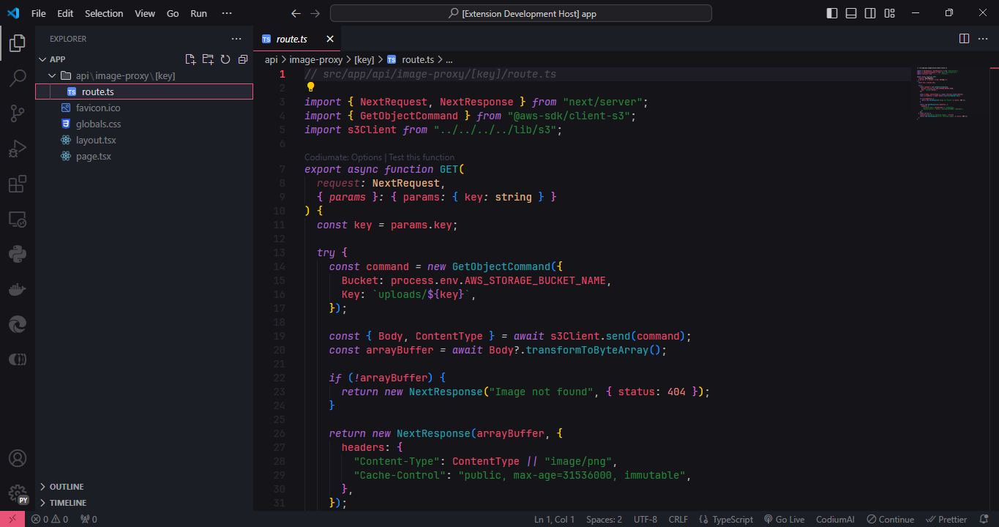

# peace theme

The peace theme is a color theme for Visual Studio Code that promotes calmness and tranquility while coding. It features soft pastel colors and minimal contrast to reduce eye strain.

Screenshot:

